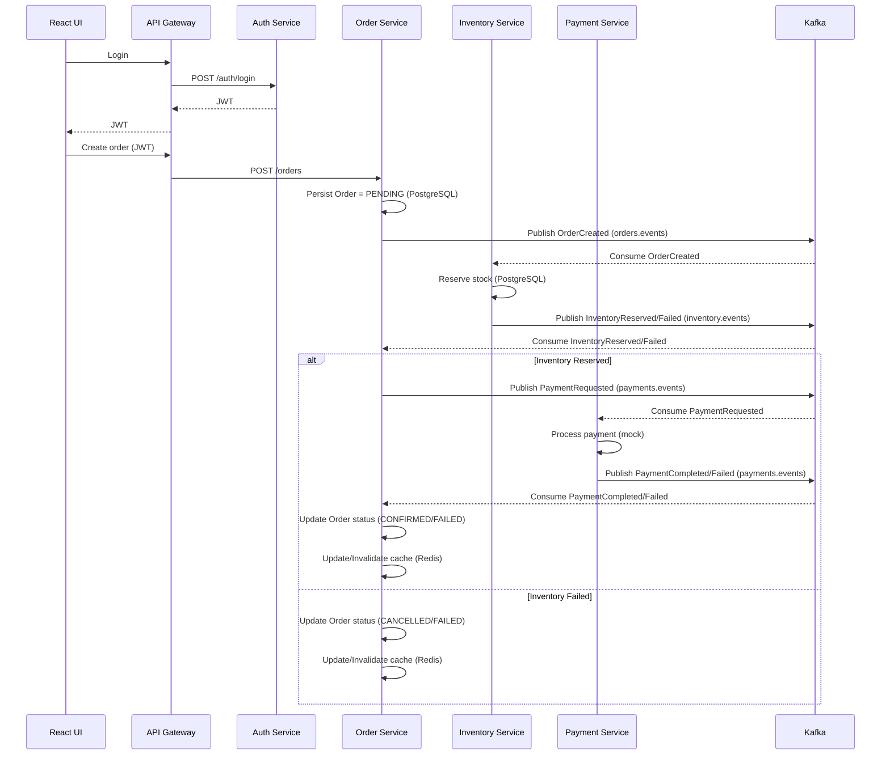

# Enterprise Full-Stack Order Management System (Microservices)

**Java • Spring Boot • Kafka • React (TypeScript) • PostgreSQL • Redis • Docker • GitHub Actions • Kubernetes (EKS-ready)**

This project is an end-to-end Order Management System built to demonstrate how real-world backend and full-stack systems are designed, secured, and deployed.
It focuses on system design, event-driven workflows, security, and reliability, not just CRUD APIs.
The application is fully runnable locally using Docker and continuously validated using GitHub Actions.

### This project was built to reflect how production systems are typically structured:
- Microservices with clear responsibilities
- Asynchronous communication using Kafka
- Centralized authentication and authorization
- Database-per-service design
- Caching for performance
- CI/CD and containerized deployment

It intentionally avoids monolithic shortcuts and instead prioritizes scalability, decoupling, and maintainability.

## Architecture 

### Services
| Service | Port | Purpose |
|---|---:|---|
| `api-gateway` | 8080 | Single entrypoint, routes, validates JWT, forwards user headers |
| `auth-service` | 8081 | Register/login, issues JWT, seeds demo users |
| `order-service` | 8082 | Creates orders, publishes events, tracks status, caches reads |
| `inventory-service` | 8083 | Product catalog + stock reservation via Kafka |
| `payment-service` | 8084 | Mock payment processing via Kafka |
| `web (React)` | 5173 | Frontend UI |

### Kafka Topics
- `orders.events`
- `inventory.events`
- `payments.events`

### Order workflow


---

### Security
- JWT-based authentication
- Role-based access control (Admin / User)
- Security enforced centrally at the API Gateway
- JWT claims propagated to downstream services

### Data & Performance
- PostgreSQL with Spring Data JPA
- Flyway database migrations
- Redis caching for frequently accessed order data
- Optimized database access patterns

## Quick start (local, runnable)

### Prerequisites
- Docker Desktop

### Run everything
```bash
docker compose up --build
```

Open:
- UI: http://localhost:5173
- Gateway: http://localhost:8080

Swagger:
- Auth: http://localhost:8081/swagger-ui.html
- Orders: http://localhost:8082/swagger-ui.html
- Inventory: http://localhost:8083/swagger-ui.html
- Payment: http://localhost:8084/swagger-ui.html

Health:
- http://localhost:8082/actuator/health

---

## Demo users
Seeded on startup:
- Admin: `admin@demo.com` / `Admin@123`
- User: `user@demo.com` / `User@123`

---

### CI / CD
- GitHub Actions runs on every commit
- Builds backend services and frontend
- Runs automated tests to validate configuration and startup
This ensures the project stays stable as changes are made.

### Containerization & Cloud Readiness
- Dockerfile per service
- Docker Compose for local orchestration
- Kubernetes manifests included
- Architecture compatible with AWS EKS deployment patterns
The services are stateless and configurable through environment variables.

### License

MIT
