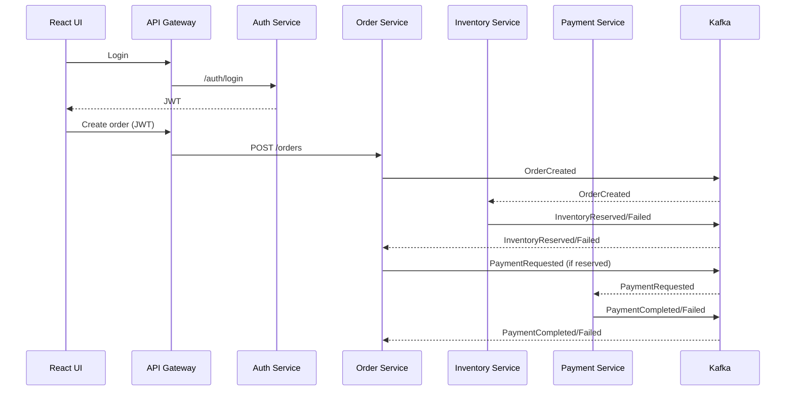

# Enterprise Full-Stack Order Management System (Microservices)
**Java • Spring Boot • Kafka • React (TypeScript) • PostgreSQL • Redis • Docker • GitHub Actions • Kubernetes (EKS-ready manifests)**

A recruiter-friendly, end-to-end **event-driven** order management platform demonstrating:
- Microservices architecture with clear domain boundaries
- **Kafka-driven workflows** (Order → Inventory → Payment → status updates)
- **JWT authentication + role-based access control (RBAC)**
- **PostgreSQL + JPA** with **Flyway** migrations
- **Redis caching** for hot order reads
- Observability: **Actuator**, structured logs, correlation IDs
- Dockerfiles per service + **Docker Compose** one-command local run
- **GitHub Actions CI**
- **Kubernetes manifests** compatible with AWS EKS

---

## Architecture (high level)

### Services
| Service | Port | Purpose |
|---|---:|---|
| `api-gateway` | 8080 | Single entrypoint, routes, validates JWT, forwards user headers |
| `auth-service` | 8081 | Register/login, issues JWT, seeds demo users |
| `order-service` | 8082 | Creates orders, publishes events, tracks status, caches reads |
| `inventory-service` | 8083 | Product catalog + stock reservation via Kafka |
| `payment-service` | 8084 | Mock payment processing via Kafka |

### Kafka Topics
- `orders.events`
- `inventory.events`
- `payments.events`

### Order workflow


---

## Quick start (local, runnable)

### Prerequisites
- Docker Desktop

### Run everything
```bash
docker compose up --build
```

Open:
- UI: http://localhost:5173
- Gateway: http://localhost:8080

Swagger:
- Auth: http://localhost:8081/swagger-ui.html
- Orders: http://localhost:8082/swagger-ui.html
- Inventory: http://localhost:8083/swagger-ui.html
- Payment: http://localhost:8084/swagger-ui.html

Health:
- http://localhost:8082/actuator/health

---

## Demo users
Seeded on startup:
- Admin: `admin@demo.com` / `Admin@123`
- User: `user@demo.com` / `User@123`

---

## Upload to GitHub
```bash
git init
git add .
git commit -m "Initial commit: enterprise order management system"
git branch -M main
git remote add origin <YOUR_REPO_URL>
git push -u origin main
```

---

## Recruiter talking points
- Designed event-driven microservices using Kafka to decouple domains and scale independently
- Implemented JWT + RBAC with Spring Security + gateway enforcement
- Built reliable async workflows via state transitions and idempotent-ish consumers
- Improved performance via Redis caching + efficient DB access
- Added production practices: Flyway migrations, Actuator health/metrics, CI, Docker, and K8s manifests

---

## License
MIT
