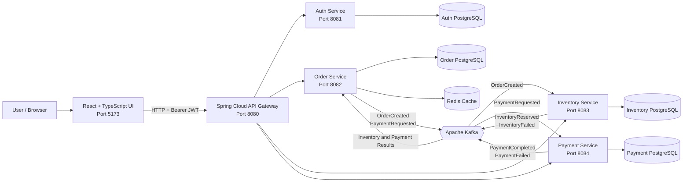
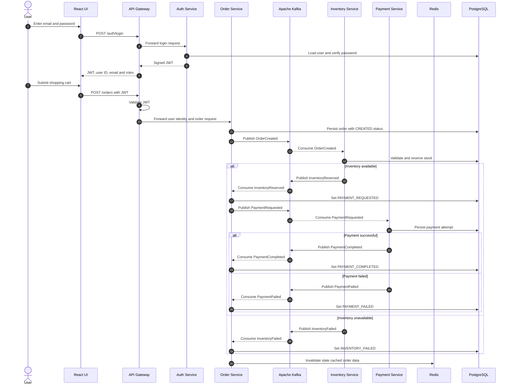
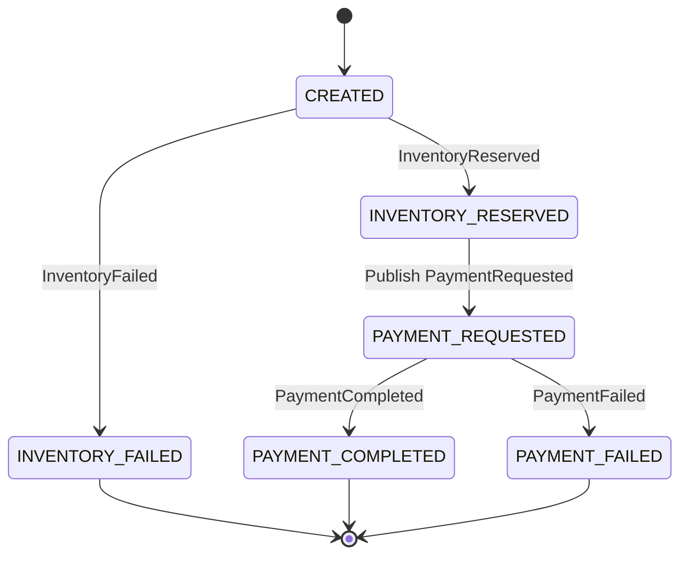
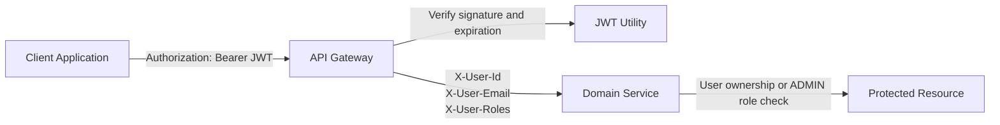
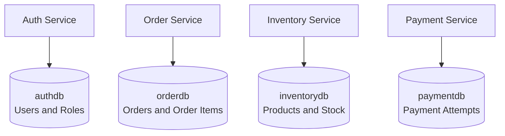
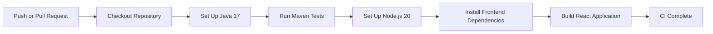

<div align="center">

# Enterprise Order Management System

### Event-Driven Full-Stack Microservices Platform

A full-stack order-processing platform built to demonstrate practical microservices architecture, asynchronous Kafka workflows, secure API access, independent databases, caching, containerization, and cloud-ready deployment patterns.

[](https://github.com/leelamanisankarpeerukattla/enterprise-order-management-system/actions/workflows/ci.yml)
[](https://openjdk.org/projects/jdk/17/)
[](https://spring.io/projects/spring-boot)
[](https://react.dev/)
[](https://kafka.apache.org/)
[](https://www.postgresql.org/)
[](LICENSE)

**Java 17 · Spring Boot · Spring Cloud Gateway · Apache Kafka · React · TypeScript · PostgreSQL · Redis · Docker · Kubernetes · GitHub Actions**

</div>

---

## Table of Contents

* [Overview](#overview)
* [Key Features](#key-features)
* [System Architecture](#system-architecture)
* [Service Responsibilities](#service-responsibilities)
* [Order Processing Workflow](#order-processing-workflow)
* [Order State Model](#order-state-model)
* [Kafka Events](#kafka-events)
* [Security Architecture](#security-architecture)
* [API Reference](#api-reference)
* [Database Architecture](#database-architecture)
* [Frontend Application](#frontend-application)
* [Quick Start](#quick-start)
* [Demo Accounts](#demo-accounts)
* [Observability](#observability)
* [Continuous Integration](#continuous-integration)
* [Containerization and Kubernetes](#containerization-and-kubernetes)
* [Project Structure](#project-structure)
* [Design Decisions](#design-decisions)
* [Future Enhancements](#future-enhancements)
* [Contributing](#contributing)
* [License](#license)

---

## Overview

This project is an end-to-end Order Management System designed around independently deployable Spring Boot microservices.

The platform demonstrates how a real-world order workflow can be divided into separate business domains for:

* Authentication
* Order management
* Product inventory
* Payment processing
* API routing
* Frontend interaction

Instead of processing the complete order through one long synchronous request, the application uses Apache Kafka to coordinate inventory reservation and payment processing asynchronously.

Each service owns its own database and communicates with other services through REST APIs or Kafka events.

The project focuses on:

* Clear microservice boundaries
* Event-driven communication
* Secure API access
* Independent data ownership
* Scalability
* Maintainability
* Containerized deployment
* Automated build validation

---

## Key Features

### Authentication and authorization

* User registration and login
* BCrypt password hashing
* JWT-based authentication
* Role-based access control
* `USER` and `ADMIN` roles
* Gateway-level token validation
* User identity propagation to downstream services

### Order management

* Create orders containing multiple products
* Calculate and store order totals
* Retrieve an individual order
* List orders belonging to the authenticated user
* Administrator access to all orders
* Track inventory and payment status asynchronously
* Cache frequently accessed order data with Redis

### Inventory management

* List available products
* Create products through administrator APIs
* Update product stock
* Persist inventory data in PostgreSQL
* Process order-created events
* Publish inventory reservation results

### Payment processing

* Consume payment requests from Kafka
* Persist payment attempts
* Simulate successful and failed payments
* Publish payment completion or failure events
* Update order status based on payment results

### Developer experience

* Maven multi-module backend
* React and TypeScript frontend
* Swagger and OpenAPI documentation
* Flyway database migrations
* Dockerfiles for each service
* Docker Compose orchestration
* Kubernetes deployment manifests
* GitHub Actions continuous integration

---

## System Architecture


```mermaid
flowchart LR
    User["User / Browser"] --> UI["React + TypeScript UI<br/>Port 5173"]

    UI -->|"HTTP + Bearer JWT"| Gateway["Spring Cloud API Gateway<br/>Port 8080"]

    Gateway --> Auth["Auth Service<br/>Port 8081"]
    Gateway --> Order["Order Service<br/>Port 8082"]
    Gateway --> Inventory["Inventory Service<br/>Port 8083"]
    Gateway --> Payment["Payment Service<br/>Port 8084"]

    Auth --> AuthDB[("Auth PostgreSQL")]
    Order --> OrderDB[("Order PostgreSQL")]
    Inventory --> InventoryDB[("Inventory PostgreSQL")]
    Payment --> PaymentDB[("Payment PostgreSQL")]

    Order --> Redis[("Redis Cache")]

    Order -->|"OrderCreated<br/>PaymentRequested"| Kafka{{"Apache Kafka"}}

    Kafka -->|"OrderCreated"| Inventory
    Inventory -->|"InventoryReserved<br/>InventoryFailed"| Kafka

    Kafka -->|"PaymentRequested"| Payment
    Payment -->|"PaymentCompleted<br/>PaymentFailed"| Kafka

    Kafka -->|"Inventory and Payment Results"| Order
```

### Communication styles

| Communication type | Purpose                          | Example                                      |
| ------------------ | -------------------------------- | -------------------------------------------- |
| REST APIs          | Immediate user-facing operations | Login, list products, create an order        |
| Kafka events       | Asynchronous business workflow   | Inventory reservation and payment processing |

The REST API returns the generated order ID while inventory and payment processing continue asynchronously.

---

## Service Responsibilities

| Component           | Port | Responsibility                                                                   |
| ------------------- | ---: | -------------------------------------------------------------------------------- |
| `web`               | 5173 | React interface for login, product selection, order creation, and order tracking |
| `api-gateway`       | 8080 | Routes requests, validates JWTs, and forwards authenticated user information     |
| `auth-service`      | 8081 | Handles user registration, login, roles, password hashing, and JWT generation    |
| `order-service`     | 8082 | Creates orders, manages order state, publishes events, and caches order reads    |
| `inventory-service` | 8083 | Manages products and stock and participates in inventory reservation workflows   |
| `payment-service`   | 8084 | Processes mock payments and publishes payment result events                      |
| `common`            |    — | Contains shared JWT utilities and Kafka event contracts                          |

---

## Order Processing Workflow


```mermaid
sequenceDiagram
    autonumber

    actor User
    participant UI as React UI
    participant GW as API Gateway
    participant Auth as Auth Service
    participant Order as Order Service
    participant Kafka as Apache Kafka
    participant Inventory as Inventory Service
    participant Payment as Payment Service
    participant Redis as Redis
    participant DB as PostgreSQL

    User->>UI: Enter email and password
    UI->>GW: POST /auth/login
    GW->>Auth: Forward login request
    Auth->>DB: Load user and verify password
    Auth-->>GW: Signed JWT
    GW-->>UI: JWT, user ID, email and roles

    User->>UI: Submit shopping cart
    UI->>GW: POST /orders with JWT
    GW->>GW: Validate JWT
    GW->>Order: Forward user identity and order request

    Order->>DB: Persist order with CREATED status
    Order->>Kafka: Publish OrderCreated

    Kafka-->>Inventory: Consume OrderCreated
    Inventory->>DB: Validate and reserve stock

    alt Inventory available
        Inventory->>Kafka: Publish InventoryReserved
        Kafka-->>Order: Consume InventoryReserved
        Order->>DB: Set PAYMENT_REQUESTED
        Order->>Kafka: Publish PaymentRequested

        Kafka-->>Payment: Consume PaymentRequested
        Payment->>DB: Persist payment attempt

        alt Payment successful
            Payment->>Kafka: Publish PaymentCompleted
            Kafka-->>Order: Consume PaymentCompleted
            Order->>DB: Set PAYMENT_COMPLETED
        else Payment failed
            Payment->>Kafka: Publish PaymentFailed
            Kafka-->>Order: Consume PaymentFailed
            Order->>DB: Set PAYMENT_FAILED
        end
    else Inventory unavailable
        Inventory->>Kafka: Publish InventoryFailed
        Kafka-->>Order: Consume InventoryFailed
        Order->>DB: Set INVENTORY_FAILED
    end

    Order->>Redis: Invalidate stale cached order data
```

---

## Order State Model


```mermaid
stateDiagram-v2
    [*] --> CREATED

    CREATED --> INVENTORY_RESERVED: InventoryReserved
    CREATED --> INVENTORY_FAILED: InventoryFailed

    INVENTORY_RESERVED --> PAYMENT_REQUESTED: Publish PaymentRequested

    PAYMENT_REQUESTED --> PAYMENT_COMPLETED: PaymentCompleted
    PAYMENT_REQUESTED --> PAYMENT_FAILED: PaymentFailed

    INVENTORY_FAILED --> [*]
    PAYMENT_COMPLETED --> [*]
    PAYMENT_FAILED --> [*]
```

### Order statuses

| Status               | Description                                   |
| -------------------- | --------------------------------------------- |
| `CREATED`            | The order was created and persisted           |
| `INVENTORY_RESERVED` | Requested inventory was successfully reserved |
| `INVENTORY_FAILED`   | Inventory could not be reserved               |
| `PAYMENT_REQUESTED`  | Payment processing was requested              |
| `PAYMENT_COMPLETED`  | Payment processing succeeded                  |
| `PAYMENT_FAILED`     | Payment processing failed                     |

---

## Kafka Events

Shared Kafka event contracts are stored in the `common` Maven module.

Each event contains:

* Event ID
* Event type
* Event timestamp
* Correlation ID
* Domain-specific payload

### Event flow

| Event                    | Producer          | Consumer          | Purpose                                       |
| ------------------------ | ----------------- | ----------------- | --------------------------------------------- |
| `OrderCreatedEvent`      | Order Service     | Inventory Service | Starts inventory reservation                  |
| `InventoryReservedEvent` | Inventory Service | Order Service     | Confirms successful stock reservation         |
| `InventoryFailedEvent`   | Inventory Service | Order Service     | Reports insufficient or unavailable inventory |
| `PaymentRequestedEvent`  | Order Service     | Payment Service   | Starts payment processing                     |
| `PaymentCompletedEvent`  | Payment Service   | Order Service     | Confirms successful payment                   |
| `PaymentFailedEvent`     | Payment Service   | Order Service     | Reports payment failure                       |

### Kafka topics

```text
orders.events
inventory.events
payments.events
```

The order ID is used as the Kafka message key so that events for the same order can remain associated with the same Kafka partition.

---

## Security Architecture


```mermaid
flowchart LR
    Client["Client Application"] -->|"Authorization: Bearer JWT"| Gateway["API Gateway"]

    Gateway -->|"Verify signature and expiration"| JWT["JWT Utility"]

    Gateway -->|"X-User-Id<br/>X-User-Email<br/>X-User-Roles"| Service["Domain Service"]

    Service -->|"User ownership or ADMIN role check"| Resource["Protected Resource"]
```

### Authentication flow

1. The user registers or logs in through the Auth Service.
2. Passwords are stored as BCrypt hashes.
3. The Auth Service generates a signed JWT.
4. The API Gateway validates the JWT.
5. The gateway extracts the user ID, email, and roles.
6. The gateway forwards the authenticated identity to downstream services.
7. Domain services perform ownership and administrator checks.

### JWT claims

The generated JWT contains:

* User ID
* Email
* Roles
* Issued-at timestamp
* Expiration timestamp

### Roles

| Role    | Access                                                       |
| ------- | ------------------------------------------------------------ |
| `USER`  | Product browsing, order creation, and access to owned orders |
| `ADMIN` | Product administration and access to all orders              |

### Public routes

The following routes do not require authentication:

```text
/auth/**
/actuator/**
/swagger-ui/**
/v3/api-docs/**
```

---

## API Reference

All normal application requests enter through the API Gateway:

```text
http://localhost:8080
```

### Authentication APIs

| Method | Endpoint         | Access | Description                    |
| ------ | ---------------- | ------ | ------------------------------ |
| `POST` | `/auth/register` | Public | Register a new user            |
| `POST` | `/auth/login`    | Public | Authenticate and receive a JWT |

### Product APIs

| Method | Endpoint                     | Access        | Description          |
| ------ | ---------------------------- | ------------- | -------------------- |
| `GET`  | `/products`                  | Authenticated | List all products    |
| `POST` | `/admin/products`            | Admin         | Create a product     |
| `PUT`  | `/admin/products/{id}/stock` | Admin         | Update product stock |

### Order APIs

| Method | Endpoint        | Access        | Description                          |
| ------ | --------------- | ------------- | ------------------------------------ |
| `POST` | `/orders`       | Authenticated | Create an order                      |
| `GET`  | `/orders`       | Authenticated | List the authenticated user’s orders |
| `GET`  | `/orders/{id}`  | Owner         | Retrieve a specific order            |
| `GET`  | `/admin/orders` | Admin         | List all orders                      |

### Login example

```bash
curl --request POST \
  --url http://localhost:8080/auth/login \
  --header "Content-Type: application/json" \
  --data '{
    "email": "user@demo.com",
    "password": "User@123"
  }'
```

Example response:

```json
{
  "token": "<JWT_TOKEN>",
  "userId": "<USER_UUID>",
  "email": "user@demo.com",
  "roles": [
    "USER"
  ]
}
```

### List products

```bash
curl --request GET \
  --url http://localhost:8080/products \
  --header "Authorization: Bearer <JWT_TOKEN>"
```

### Create an order

Use a product ID returned by `GET /products`.

```bash
curl --request POST \
  --url http://localhost:8080/orders \
  --header "Authorization: Bearer <JWT_TOKEN>" \
  --header "Content-Type: application/json" \
  --data '{
    "items": [
      {
        "productId": "<PRODUCT_UUID>",
        "quantity": 2
      }
    ]
  }'
```

Example response:

```json
{
  "orderId": "<ORDER_UUID>"
}
```

### Retrieve an order

```bash
curl --request GET \
  --url http://localhost:8080/orders/<ORDER_UUID> \
  --header "Authorization: Bearer <JWT_TOKEN>"
```

### Swagger UI

When the services are running locally:

| Service           | Swagger URL                             |
| ----------------- | --------------------------------------- |
| Auth Service      | `http://localhost:8081/swagger-ui.html` |
| Order Service     | `http://localhost:8082/swagger-ui.html` |
| Inventory Service | `http://localhost:8083/swagger-ui.html` |
| Payment Service   | `http://localhost:8084/swagger-ui.html` |

---

## Database Architecture

The system follows the database-per-service pattern.


```mermaid
flowchart TB
    Auth["Auth Service"] --> AuthDB[("authdb<br/>Users and Roles")]
    Order["Order Service"] --> OrderDB[("orderdb<br/>Orders and Order Items")]
    Inventory["Inventory Service"] --> InventoryDB[("inventorydb<br/>Products and Stock")]
    Payment["Payment Service"] --> PaymentDB[("paymentdb<br/>Payment Attempts")]
```

### Service databases

| Service           | Database      | Local host port |
| ----------------- | ------------- | --------------: |
| Auth Service      | `authdb`      |            5433 |
| Order Service     | `orderdb`     |            5434 |
| Inventory Service | `inventorydb` |            5435 |
| Payment Service   | `paymentdb`   |            5436 |

### Auth database

Stores:

* Users
* Email addresses
* BCrypt password hashes
* User roles
* Account creation timestamps

### Order database

Stores:

* Orders
* Order ownership
* Order status
* Order totals
* Order items
* Product IDs
* Quantity
* Price snapshots

### Inventory database

Stores:

* Product IDs
* Product names
* Prices
* Available stock

### Payment database

Stores:

* Payment IDs
* Associated order IDs
* Payment amount
* Payment status
* Creation timestamp

### Flyway migrations

Every service uses Flyway to manage database schema changes.

Hibernate validates the entity model against the database schema using:

```yaml
spring:
  jpa:
    hibernate:
      ddl-auto: validate
```

This prevents Hibernate from silently creating or changing production schemas.

---

## Frontend Application

The frontend is built with React, TypeScript, and Vite.

### Supported user interactions

* Login with a demo account
* Load available products
* Select product quantities
* Calculate the order total
* Place an order
* View the authenticated user’s orders
* View detailed order information
* Refresh the order to observe asynchronous status updates

### Frontend stack

* React 18
* TypeScript
* Vite
* Browser Fetch API
* JWT bearer authentication

### API configuration

The frontend API location is configured through:

```text
VITE_API_BASE
```

The default API Gateway URL is:

```text
http://localhost:8080
```

---

## Quick Start

### Prerequisites

Install the following:

* Docker Desktop
* Git
* Java 17
* Maven 3.9+
* Node.js 20+

### Clone the repository

```bash
git clone https://github.com/leelamanisankarpeerukattla/enterprise-order-management-system.git

cd enterprise-order-management-system
```

### Run with Docker Compose

```bash
docker compose up --build
```

Docker Compose starts:

* Kafka
* Redis
* Four PostgreSQL databases
* Auth Service
* Order Service
* Inventory Service
* Payment Service
* API Gateway
* React frontend

### Application URLs

| Component         | URL                     |
| ----------------- | ----------------------- |
| Frontend          | `http://localhost:5173` |
| API Gateway       | `http://localhost:8080` |
| Auth Service      | `http://localhost:8081` |
| Order Service     | `http://localhost:8082` |
| Inventory Service | `http://localhost:8083` |
| Payment Service   | `http://localhost:8084` |

### Stop the application

```bash
docker compose down
```

### Remove containers and database volumes

```bash
docker compose down --volumes
```

### Run backend tests

From the repository root:

```bash
mvn test
```

### Build the frontend

```bash
cd web

npm install

npm run build
```

---

## Demo Accounts

The Auth Service automatically creates the following demo users.

| Role          | Email            | Password    |
| ------------- | ---------------- | ----------- |
| Administrator | `admin@demo.com` | `Admin@123` |
| Standard user | `user@demo.com`  | `User@123`  |

> These accounts are intended only for local development and demonstration.

---

## Observability

### Spring Boot Actuator

The services expose health and operational endpoints through Spring Boot Actuator.

Examples:

```text
http://localhost:8081/actuator/health
http://localhost:8082/actuator/health
http://localhost:8083/actuator/health
http://localhost:8084/actuator/health
```

The Auth and Order services also expose application metrics.

### Correlation IDs

Correlation IDs are used to improve request tracing across service logs.

The correlation ID is included in logging output using the following pattern:

```text
INFO [corr=<correlation-id>]
```

Kafka events also contain a correlation ID, allowing an order workflow to be followed across service boundaries.

---

## Continuous Integration

The repository uses GitHub Actions for continuous integration.

The workflow runs when:

* Code is pushed to the `main` branch
* A pull request is created or updated

### CI workflow


```mermaid
flowchart LR
    Trigger["Push or Pull Request"] --> Checkout["Checkout Repository"]
    Checkout --> Java["Set Up Java 17"]
    Java --> Backend["Run Maven Tests"]
    Backend --> Node["Set Up Node.js 20"]
    Node --> Dependencies["Install Frontend Dependencies"]
    Dependencies --> Frontend["Build React Application"]
    Frontend --> Complete["CI Complete"]
```

### Backend validation

```bash
mvn -q test
```

### Frontend validation

```bash
cd web
npm install
npm run build
```

The workflow ensures that backend modules compile, tests pass, and the frontend builds successfully before changes are merged.

---

## Containerization and Kubernetes

### Docker

The repository includes:

* Dockerfiles for every Spring Boot service
* A Dockerfile for the React frontend
* Multi-stage Java container builds
* Docker Compose orchestration
* Environment-variable-based configuration
* Kafka running in KRaft mode
* Redis
* Independent PostgreSQL containers

### Kubernetes

The repository also includes Kubernetes manifests for cloud-oriented deployments.

The Kubernetes configuration provides a foundation for deployment to environments such as Amazon EKS.

The architecture supports:

* Independent service deployments
* Horizontal scaling
* Service discovery
* Environment-specific configuration
* Health checks
* Container orchestration

A cloud deployment can extend the manifests with:

* Kubernetes Secrets
* ConfigMaps
* Ingress
* TLS certificates
* Persistent volumes
* Horizontal Pod Autoscaling
* Resource requests and limits
* Network policies
* Managed PostgreSQL
* Managed Kafka
* Managed Redis

---

## Project Structure

```text
enterprise-order-management-system/
├── .github/
│   └── workflows/
│       └── ci.yml
│
├── common/
│   ├── Shared Kafka event contracts
│   └── Shared JWT utilities
│
├── api-gateway/
│   ├── Spring Cloud Gateway routes
│   └── JWT authentication filter
│
├── auth-service/
│   ├── User registration
│   ├── Login
│   ├── JWT generation
│   ├── User roles
│   └── Auth database migrations
│
├── order-service/
│   ├── Order APIs
│   ├── Order lifecycle
│   ├── Kafka producers and consumers
│   ├── Redis caching
│   └── Order database migrations
│
├── inventory-service/
│   ├── Product APIs
│   ├── Stock management
│   ├── Inventory event processing
│   └── Inventory database migrations
│
├── payment-service/
│   ├── Payment processing
│   ├── Payment event publishing
│   └── Payment database migrations
│
├── web/
│   ├── React application
│   ├── TypeScript API client
│   └── Vite configuration
│
├── k8s/
│   └── Kubernetes deployment manifests
│
├── docker-compose.yml
├── pom.xml
├── README.md
├── CONTRIBUTING.md
├── SECURITY.md
├── CODE_OF_CONDUCT.md
└── LICENSE
```

---

## Design Decisions

### Event-driven order workflow

Kafka decouples the Order, Inventory, and Payment services.

This allows each domain to:

* Process events independently
* Scale separately
* Handle temporary failures
* Avoid long synchronous request chains
* Evolve without tightly coupling implementations

### API Gateway

The API Gateway provides a single entry point for clients.

It handles:

* Request routing
* JWT validation
* Public-route configuration
* User identity propagation
* Centralized access control

### Database per service

Each service owns its own PostgreSQL database.

Benefits include:

* Independent schema evolution
* Clear domain ownership
* Reduced coupling
* Independent scaling
* Safer service deployments

### Redis caching

The Order Service caches individual order reads.

Redis helps:

* Reduce repeated database queries
* Improve response times
* Support read-heavy order-status checks
* Keep application services stateless

The cache is invalidated when inventory or payment events update an order.

### Flyway migrations

Database schemas are defined through version-controlled Flyway migrations.

This provides:

* Repeatable environment setup
* Explicit schema history
* Controlled database changes
* Compatibility with automated deployments

### Stateless services

Application instances do not store durable state locally.

Persistent state is stored in:

* PostgreSQL
* Redis
* Kafka

This makes services easier to restart, replace, and horizontally scale.

---

## Future Enhancements

* Transactional outbox pattern
* Idempotent Kafka consumers
* Retry and dead-letter topics
* Inventory compensation after payment failure
* Distributed tracing with OpenTelemetry
* Prometheus metrics and Grafana dashboards
* Centralized structured logging
* Testcontainers integration tests
* Kafka consumer contract testing
* API rate limiting
* Circuit breakers and timeouts
* Container image publishing
* Automated staging deployment
* Canary or blue-green production deployment
* Managed Kafka, PostgreSQL, and Redis
* Production payment-provider integration
* Expanded administrator frontend
* Email or notification service
* Order cancellation and refund workflows

---

## Contributing

Contributions and improvement suggestions are welcome.

Before contributing, review:

* [Contributing Guide](CONTRIBUTING.md)
* [Code of Conduct](CODE_OF_CONDUCT.md)
* [Security Policy](SECURITY.md)

### Contribution workflow

```bash
git checkout -b feature/your-feature

git add .

git commit -m "Add your feature"

git push origin feature/your-feature
```

Then open a pull request describing the proposed changes.

---

## License

This project is licensed under the [MIT License](LICENSE).

---

## Author

**Leela Mani Sankar Peerukattla**

[GitHub Profile](https://github.com/leelamanisankarpeerukattla)

---

<div align="center">

Built to demonstrate practical backend engineering, event-driven architecture, full-stack development, distributed systems, and cloud-native software design.

</div>
